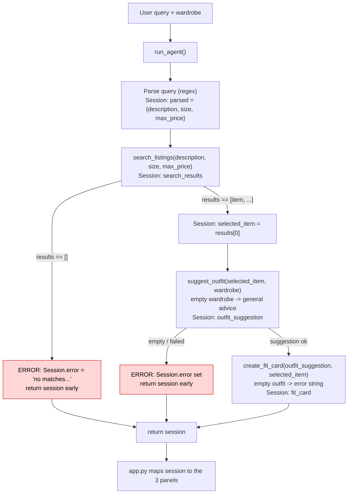

# FitFindr — planning.md

> Complete this document before writing any implementation code.
> Your spec and agent diagram are what you'll use to direct AI tools (Claude, Copilot, etc.) to generate your implementation — the more specific they are, the more useful the generated code will be.
> Your planning.md will be reviewed as part of your submission.
> Update it before starting any stretch features.

---

## Tools

List every tool your agent will use. For each tool, fill in all four fields.
You must have at least 3 tools. The three required tools are listed — add any additional tools below them.

### Tool 1: search_listings

**What it does:**

<!-- Describe what this tool does in 1–2 sentences -->

Searches the 40-item mock listings dataset for pieces matching what I asked for. It filters by an optional size and an optional price ceiling, then scores whatever is left by keyword overlap with my description and hands back the matches best first.

**Input parameters:**

<!-- List each parameter, its type, and what it represents -->

- `description` (str): keywords for what I'm after, like "vintage graphic tee". Required, drives the relevance scoring.

- `size` (str | None): size to filter on, matched case-insensitively. None skips size filtering.

- `max_price` (float | None): inclusive price ceiling in dollars. None skips price filtering.

**What it returns:**

<!-- Describe the return value — what fields does a result contain? -->

A `list[dict]` of listing dicts, sorted by relevance (highest keyword overlap first). Each dict has: `id`, `title`, `description`, `category`, `style_tags` (list), `size`, `condition`, `price` (float), `colors` (list), `brand` (str or None), `platform`. Returns an empty list when nothing matches. It never raises.

**What happens if it fails or returns nothing:**

<!-- What should the agent do if no listings match? -->

It returns `[]`. The agent reads that empty list as the no-results branch, writes a helpful message into `session["error"]` telling me what to loosen (bump the price, drop the size, or use simpler keywords), and stops before calling the other tools. It does not pass empty input downstream.

---

### Tool 2: suggest_outfit

**What it does:**

<!-- Describe what this tool does in 1–2 sentences -->

Takes the listing I picked plus my wardrobe and asks Groq (llama-3.3-70b-versatile) to put together one or two complete outfits that pair the new piece with things I already own, with a quick note on how to wear it.

**Input parameters:**

<!-- List each parameter, its type, and what it represents -->

- `new_item` (dict): the listing I'm considering, straight from `search_results` (same fields as Tool 1's output).

- `wardrobe` (dict): a dict with an `items` key holding a list of wardrobe item dicts. Each item has `id`, `name`, `category`, `colors`, `style_tags`, `notes`. The list can be empty.

**What it returns:**

<!-- Describe the return value -->

A non-empty `str` describing one or two outfits, naming specific wardrobe pieces by name when the wardrobe has items.

**What happens if it fails or returns nothing:**

<!-- What should the agent do if the wardrobe is empty or no outfit can be suggested? -->

If `wardrobe["items"]` is empty, it still returns a useful string with general styling advice for the item instead of crashing or returning "". If the LLM call itself errors, it catches the exception and returns a short fallback styling string so the run keeps going.

---

### Tool 3: create_fit_card

**What it does:**

<!-- Describe what this tool does in 1–2 sentences -->

Turns the outfit suggestion and the item into a short, shareable caption, the kind of thing I'd actually post with an OOTD photo. Uses Groq with a higher temperature so it reads different every time.

**Input parameters:**

<!-- List each parameter, its type, and what it represents -->

- `outfit` (str): the outfit suggestion string returned by `suggest_outfit`.

- `new_item` (dict): the listing dict for the thrifted piece (used to mention name, price, and platform).

**What it returns:**

<!-- Describe the return value -->

A 2 to 4 sentence `str` caption. Casual and authentic, mentions the item name, price, and platform once each, and captures the vibe in specific terms.

**What happens if it fails or returns nothing:**

<!-- What should the agent do if the outfit data is incomplete? -->

If `outfit` is empty or just whitespace, it returns a descriptive error message string (something like "I can't write a fit card without an outfit yet, run suggest_outfit first") instead of raising. If the LLM call errors, it catches it and returns a short fallback caption or error string.

---

### Additional Tools (if any)

<!-- Copy the block above for any tools beyond the required three -->

None for the base project. Stretch tools (price check, retry-with-loosened-filters) would be added here, and I'll update this file before starting any of them.

---

## Planning Loop

**How does your agent decide which tool to call next?**

<!-- Describe the logic your planning loop uses. What does it look at? What conditions change its behavior? How does it know when it's done? -->

The loop runs inside `run_agent(query, wardrobe)` and works off the session dict, branching on what each tool returns rather than firing all three no matter what.

1. Build a fresh session with `_new_session(query, wardrobe)`.
2. Parse the query with regex/string parsing into a description, an optional size, and an optional max_price, and store them in `session["parsed"]`. Price comes from a `$N` / "under N" / "below N" pattern, size from matching a known set of size tokens, and the leftover words become the description.
3. Call `search_listings(description, size, max_price)` and store the result in `session["search_results"]`.
4. Branch on the results. If the list is empty, set `session["error"]` to a helpful message and return the session right away. Do not call `suggest_outfit`. This is the spot where the agent's behavior actually changes based on what it got back.
5. If there are results, set `session["selected_item"] = search_results[0]` (the top match).
6. Call `suggest_outfit(selected_item, wardrobe)` and store the string in `session["outfit_suggestion"]`.
7. Guard: if the suggestion came back empty or falsy, set `session["error"]` and skip the fit card. Otherwise continue.
8. Call `create_fit_card(outfit_suggestion, selected_item)` and store it in `session["fit_card"]`.
9. Return the session.

It knows it's done when it either hits the empty-results return in step 4 or finishes step 8 with a fit card in the session.

---

## State Management

**How does information from one tool get passed to the next?**

<!-- Describe how your agent stores and accesses state within a session. What data is tracked? How is it passed between tool calls? -->

One session dict, created by `_new_session()`, is the single source of truth for the whole run, and every tool reads from and writes back to it. Nothing is re-entered by the user and nothing is hardcoded between steps.

What it tracks:

- `query`: the original text I typed.
- `parsed`: the description / size / max_price pulled out of the query.
- `search_results`: the list of matching listings.
- `selected_item`: the top listing, which is exactly the dict handed to `suggest_outfit`.
- `wardrobe`: my wardrobe dict.
- `outfit_suggestion`: the string from `suggest_outfit`, which is exactly what goes into `create_fit_card`.
- `fit_card`: the final caption.
- `error`: set only if the run ended early, None otherwise.

So `search_listings` fills `selected_item`, which flows into `suggest_outfit`, whose output fills `outfit_suggestion`, which flows into `create_fit_card`. The agent reads `error` first to decide whether the rest of the fields are valid.

---

## Error Handling

For each tool, describe the specific failure mode you're handling and what the agent does in response.

| Tool            | Failure mode                          | Agent response                                                                                                                                                                                                      |
| --------------- | ------------------------------------- | ------------------------------------------------------------------------------------------------------------------------------------------------------------------------------------------------------------------- |
| search_listings | No results match the query            | Returns `[]`. The agent sets `session["error"]` to "I couldn't find anything matching that. Try raising your max price, dropping the size filter, or using simpler keywords," and stops before the other tools run. |
| suggest_outfit  | Wardrobe is empty                     | Returns general styling advice for the item (what pairs well, what vibe it suits) instead of crashing or returning "", so the run continues to the fit card.                                                        |
| create_fit_card | Outfit input is missing or incomplete | Returns a descriptive error string like "I can't write a fit card without an outfit yet" rather than raising, so the UI shows a clear message instead of a stack trace.                                             |

---

## Architecture

<!-- Draw a diagram of your agent showing how the components connect:
     User input → Planning Loop → Tools (search_listings, suggest_outfit, create_fit_card)
                                                                          ↕
                                                                   State / Session
     Show what triggers each tool, how state flows between them, and where error paths branch off.
     ASCII art, a Mermaid diagram (https://mermaid.js.org/syntax/flowchart.html), or an embedded
     sketch are all fine. You'll share this diagram with an AI tool when asking it to implement
     the planning loop and each individual tool. -->



---

## AI Tool Plan

<!-- For each part of the implementation below, describe:
     - Which AI tool you plan to use (Claude, Copilot, ChatGPT, etc.)
     - What you'll give it as input (which sections of this planning.md, your agent diagram)
     - What you expect it to produce
     - How you'll verify the output matches your spec before moving on

     "I'll use AI to help me code" is not a plan.
     "I'll give Claude my Tool 1 spec (inputs, return value, failure mode) and ask it to implement
     search_listings() using load_listings() from the data loader — then test it against 3 queries
     before trusting it" is a plan. -->

**Milestone 3 — Individual tool implementations:**

I'll use Claude. For each tool I'll paste that tool's block from this file (inputs, return value, failure mode) plus the matching stub and docstring from tools.py, one tool at a time. For `search_listings` I'll tell it to use `load_listings()` from utils/data_loader.py and not re-read the file. For `suggest_outfit` and `create_fit_card` I'll tell it to use the existing `_get_groq_client()` helper with llama-3.3-70b-versatile. Before trusting any generated function I'll check it against the spec: does `search_listings` filter on all three params and return `[]` on no match, does `suggest_outfit` branch on an empty wardrobe, does `create_fit_card` guard an empty outfit and use a high enough temperature to vary. Then I'll run `pytest tests/` with one test per failure mode.

**Milestone 4 — Planning loop and state management:**

I'll give Claude the Planning Loop and State Management sections above plus the ASCII diagram and the agent.py stub, and ask it to implement `run_agent` following the numbered steps. Before running it I'll check that it branches on an empty `search_results` (early return, no `suggest_outfit` call), that it writes each result back into the session dict, and that it does not call all three tools unconditionally. I'll verify by running `python agent.py` and confirming the happy path fills `fit_card` while the no-results path sets `error` and leaves `fit_card` as None.

---

## A Complete Interaction (Step by Step)

Write out what a full user interaction looks like from start to finish — tool call by tool call. Use a specific example query.

FitFindr takes my plain-English thrifting request and works through it step by step. It kicks off search_listings to pull matching secondhand pieces, and as long as something comes back it grabs the top hit and runs suggest_outfit to style it against my wardrobe, then create_fit_card to spit out a caption I'd actually post. Each tool hands its result to the next through session state, so I never have to re-type the item. If the search comes up empty it stops right there and tells me what to loosen instead of styling nothing, an empty wardrobe just falls back to general advice, and a missing outfit returns an error message instead of blowing up.

**Example user query:** "I'm looking for a vintage graphic tee under $30. I mostly wear baggy jeans and chunky sneakers. What's out there and how would I style it?"

**Step 1:**

<!-- What does the agent do first? Which tool is called? With what input? -->

The agent parses the query into `description="vintage graphic tee"`, `size=None` (I didn't name one), and `max_price=30.0`, and stores that in `session["parsed"]`. It calls `search_listings("vintage graphic tee", None, 30.0)`, which returns the tees under $30 sorted by relevance: lst_006 "Graphic Tee — 2003 Tour Bootleg Style" ($24, depop), lst_033 "Vintage Band Tee — Faded Grey" ($19, depop), and lst_002 "Y2K Baby Tee — Butterfly Print" ($18, depop). The agent stores the list and sets `selected_item` to the top one, lst_006.

**Step 2:**

<!-- What happens next? What was returned from step 1? What tool is called now? -->

With results in hand, the agent calls `suggest_outfit(selected_item=lst_006, wardrobe=example_wardrobe)`. The wardrobe has baggy straight-leg jeans and chunky white sneakers, so the LLM returns something like: pair the bootleg graphic tee with the baggy dark-wash jeans and chunky white sneakers for a 2000s streetwear look, tuck the front hem, and throw the black denim jacket over it. That string goes into `session["outfit_suggestion"]`.

**Step 3:**

<!-- Continue until the full interaction is complete -->

The agent calls `create_fit_card(outfit_suggestion, selected_item=lst_006)`. It returns a short caption, something like: "found this 2003 tour bootleg tee on depop for $24 and it goes way too hard with my baggy jeans and chunky sneakers. full 2000s mode. denim jacket on top when it gets cold." That goes into `session["fit_card"]`.

**Final output to user:**

<!-- What does the user actually see at the end? -->

app.py reads the finished session and fills the three panels:

```
The top listing (Graphic Tee — 2003 Tour Bootleg Style, $24, depop, good condition), the outfit idea from step 2, and the fit card caption from step 3. If search had returned nothing, the first panel would instead show the error message and the other two would stay empty.
```
